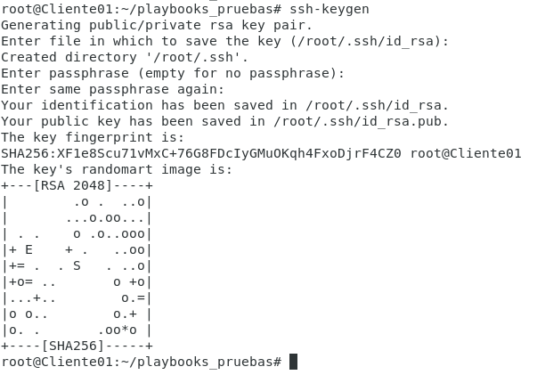

# Instalar Apache2 y Configurar Sitios Virtuales

## Mi Red


| Equipo | | IP | | Paquetes necesarios|
| -- |
| ServidorWeb | | 192.168.0.254 | | Únicamente ssh |
| ServidorWeb2 | | 192.168.0.253 | | Únicamente ssh |
| ServidorAnsible | | 192.168.0.95 | | Ansible, python, ssh |

## Servidor Ansible

Generamos unas claves SSH para la conectarnos sin necesidad de introducir contraseña

```bash
ssh-keygen
```



### Exportamos nuestra clave pública a los servidores

```bash
ssh-copy-id -i /root/.ssh/id_rsa.pub usuario@192.168.0.253
```

```bash
ssh-copy-id -i /root/.ssh/id_rsa.pub usuario@192.168.0.254
```

*Al ser la primera conexion nos pedirá la clave del servidor que nos estamos conectando*


### Prueba de conexión


*No ha sido necesaría la autenticación*

### Creamos el fichero hosts

```bash
vi hosts
```

*Contenido:*

```
[grupoServidoresWebs1]
192.168.0.254
192.168.0.253
```
### Script de configuración de Ansible (YAML)

```YAML
---
- hosts: grupoServidoresWebs1
  remote_user: usuario
  tasks: 
    - name: Instalar apache2 en los servidores Webs latest
      apt: name=apache2 state=latest
      become: yes
    - name: Start/Enable
      service:
        name: apache2
        state: started
        enabled: yes
      become: yes
    - name: Transferencia de Scripts
      copy:
        src: ./scriptSitiosVirtuales.sh
        dest: /home/usuario 
        owner: usuario
        group: usuario
        mode: 0755
    - name: Configurar Sitios Virtuales
      command: /home/usuario/scriptSitiosVirtuales.sh
      become: yes
```
*El usuario "usuario" tiene privilegios de sudo completo*

### Script que exportaremos

Exportaremos el script desde *ServidorAnsible* **->** *grupoServidoresWebs1*

```bash
#!/bin/bash
# Carpeta Web
sudo mkdir /var/www/pagina1
sudo echo "<h1>Bienvenido a su espacio Web</h1>" > /var/www/pagina1/index.html
sudo chown -R  www-data:www-data /var/www/pagina1/
#Sitio Virtual
sudo echo '<VirtualHost *:8081>' > /etc/apache2/sites-available/pagina1.conf
sudo echo 'ServerAdmin webmaster@localhost' >> /etc/apache2/sites-available/pagina1.conf
sudo echo 'DocumentRoot /var/www/pagina1' >> /etc/apache2/sites-available/pagina1.conf
sudo echo 'ErrorLog ${APACHE_LOG_DIR}/error_pagina1.log' >> /etc/apache2/sites-available/pagina1.conf
sudo echo 'CustomLog ${APACHE_LOG_DIR}/access_pagina1.log combined' >> /etc/apache2/sites-available/pagina1.conf
sudo echo '</VirtualHost>' >> /etc/apache2/sites-available/pagina1.conf
# Añadimos el puerto
sudo echo "Listen 8081" >> /etc/apache2/ports.conf
# Activamos sitio virtual
cd /etc/apache2/sites-available/
sudo a2ensite pagina1.conf
# Reiniciamos Servicios
sudo systemctl restart apache2 >> /dev/null
sudo systemctl status apache2 > EstadoServicio$(date +%d-%m-%Y).txt
```
### Ejecutamos las tareas configuradas en fichero YAML


```bash
ansible-playbook -i hosts --ask-become-pass webServer.yml
```


_________________________________________________
*[Volver atrás...](../README.md)*