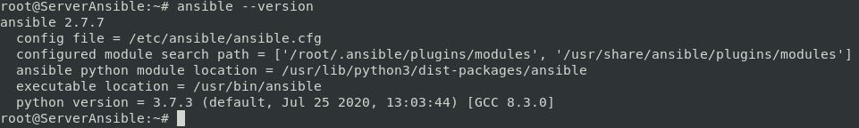

# Ansible
Este repositorio lo utulizaré para docuemntar y compartir mis pruebas con Ansible...

## [1.- Instalar Apache2 y Configurar Sitios Virtuales.](./PruebaApache/)
<!-- ## [2.- 
## [3.-  -->


### Pasos Previos...
> [!IMPORTANT]
> Los repositorios debian Buster nos brindará una versión de ansible que probablemente **NO sea la mas reciente**.
> Ansible necesita de Python para funcionar, en caso de añadir el repositorio de ansible tendremos que ver la versión de python que necesitamos

## Instalar Ansible desde los repositorios de Debian Buster

```bash
apt-get update -y
apt-get install ansible -y
```

> [!TIP]
> En en caso de no estar instalado python se instalará durante instalación de ansible

## Vemos la versión de Ansible


